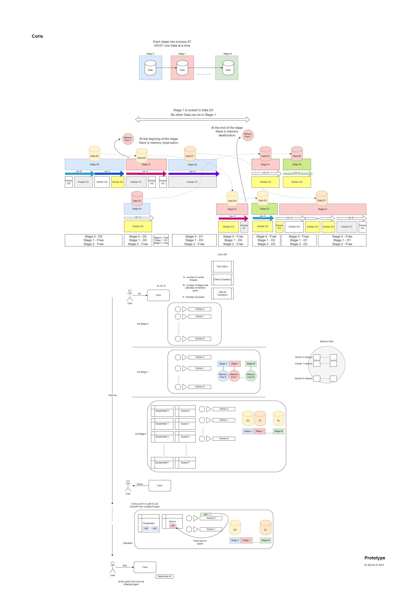

# Coris

Coroutine based, asynchronous jobs controller.

## Requirements

- **GCC-13** or higher
- **Ninja-build**

## Prepare

```bash
git clone git@github.com:MisterSawyer/coris.git
cd coris
mkdir build
cd build
```

## Build and Install

```bash
cmake -GNinja ../
ninja
cmake --install .
```



<object data="diagram.pdf" type="application/pdf" width="700px" height="700px">
    <embed src="diagram.pdf">
        <p>This view does not support PDFs. Please download PDF diagram to view it: <a href="diagram.pdf">Download diagram</a>.</p>
    </embed>
</object>
